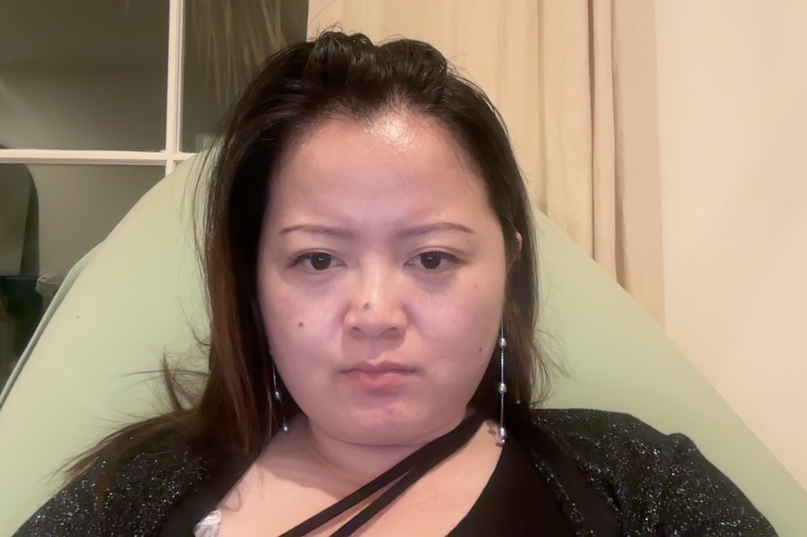
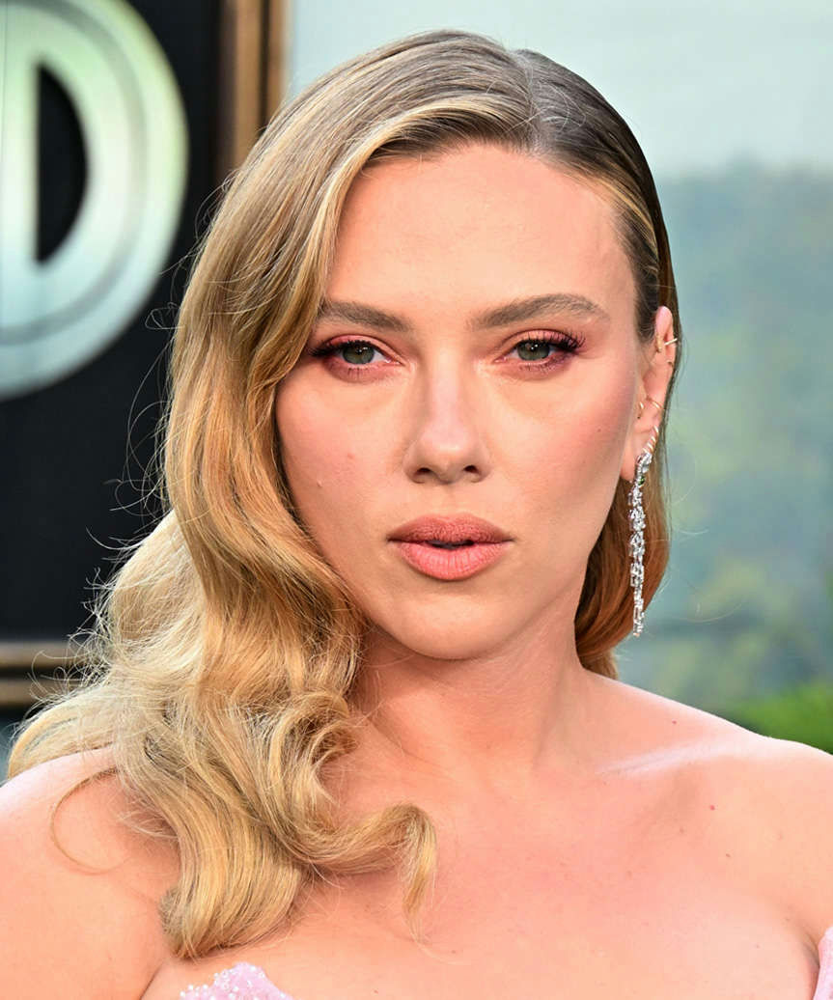

# Performance Optimization Guide

The hairstyle generation API now supports optional performance parameters to control speed vs quality.

---

## 🚀 Quick Start - How to Use

Pass these optional parameters via FormData:

```javascript
// FAST MODE - Save ~28s (72% faster!)
formData.append('skipRemoveHair', 'true');    // Skip hair removal (-9s)
formData.append('skipRelight', 'true');        // Skip relighting (-11s)
formData.append('numGenerations', '1');        // Just 1 generation (-8s)
formData.append('skipEvaluation', 'true');     // Skip GPT eval (-3s)

// BALANCED MODE - Save ~6s (16% faster)
formData.append('numGenerations', '3');        // Use 3 instead of 5

// DEFAULT MODE - Don't add any parameters (best quality)
```

---

## 📊 Performance Results (From Timing Benchmarks)

| Mode | Time | Savings | When to Use |
|------|------|---------|-------------|
| **Default** | 38.7s | baseline | Best quality, final results |
| **Balanced** | 32.7s | -6s (16%) | Good speed/quality balance ⭐ |
| **Skip Preprocessing** | 11.7s | -27s (70%) | Original has short hair |
| **Fast Mode** | 10.8s | -28s (72%) | Quick previews, rapid testing |

---

## 🎨 Quality Test Results (With Actual Image Generation)

| Configuration | Runtime | Description | Output File |
|--------------|---------|-------------|-------------|
| **numGen_1** | 23.4s | 1 generation with full preprocessing | `output_numGen_1.jpg` |
| **numGen_3** | 38.5s | 3 generations with full preprocessing | `output_numGen_3.jpg` |
| **numGen_5** (default) | 33.4s | 5 generations with full preprocessing | `output_numGen_5.jpg` |
| **skip_remove_hair** | 35.1s | Skip only hair removal, 5 generations | `output_skip_remove_hair.jpg` |
| **skip_relight** | 28.7s | Skip only relighting, 5 generations | `output_skip_relight.jpg` |
| **skip_both_preprocessing** | 21.3s | Skip both preprocessing, 5 generations | `output_skip_both_preprocessing.jpg` |
| **fast_mode** | 13.3s | Skip preprocessing, 1 gen, skip eval | `output_fast_mode.jpg` |

### 📷 Visual Comparison

#### Source Images

| Original Image | Reference Hairstyle |
|----------------|---------------------|
|  |  |

#### Generation Count Tests (With Full Preprocessing)

| numGen_1 (23.4s) | numGen_3 (38.5s) | numGen_5 (33.4s) |
|------------------|------------------|------------------|
|  |  |  |
| 1 generation | 3 generations | 5 generations (default) |

#### Preprocessing Tests (5 Generations Each)

| skip_remove_hair (35.1s) | skip_relight (28.7s) | skip_both (21.3s) |
|-------------------------|---------------------|-------------------|
|  |  |  |
| Skip hair removal only | Skip relighting only | Skip both preprocessing |

#### Fast Mode

| fast_mode (13.3s) |
|-------------------|
|  |
| Skip preprocessing + 1 gen + skip eval |

### 🔍 Key Findings

1. **Fast mode is 60% faster** than default (13.3s vs 33.4s)
2. **Skipping both preprocessing saves ~12s** compared to default
3. **Number of generations** has varying impact on time due to parallel processing
4. **GPT evaluation works correctly** - selected different indices based on quality
5. All modes produced valid outputs - **compare images above for quality assessment**

---

## 🎛️ Available Parameters

| Parameter | Type | Default | Savings | Description |
|-----------|------|---------|---------|-------------|
| `skipRemoveHair` | boolean | `false` | ~9s | Skip hair removal preprocessing |
| `skipRelight` | boolean | `false` | ~11s | Skip lighting adjustment |
| `numGenerations` | 1-10 | `5` | varies | Number of parallel generations |
| `skipEvaluation` | boolean | `false` | ~3-5s | Skip GPT best-image selection |

---

## 💡 Recommendations

**For most use cases:** Use `numGenerations: 3` (balanced mode)

**Skip preprocessing when:**
- Original person has very short hair or is bald
- Lighting already matches between images
- Speed is critical for previews

**Use fast mode for:**
- Rapid prototyping
- Testing different hairstyles quickly
- Quick previews before final generation

---

## 🧪 Running Benchmarks

Test all configurations:

```bash
npx tsx benchmark/benchmark-simple.ts
```

This will measure:
1. Default (Full Quality)
2. Balanced (numGenerations=3)
3. Skip Preprocessing Only
4. Fast Mode (All Optimizations)

---

## 📝 Technical Details

**What was discovered:**
- The pipeline does 7 total nano banana API calls (not 5!)
- Preprocessing (removeHair + relight) = 2 API calls taking ~20s
- Main generation = 5 parallel API calls taking ~11-19s
- GPT evaluation adds ~3-5s

**Files modified:**
- `src/app/api/generate-hairstyle/route.ts`
- `src/utils/image/parallel-generation/parallel-generation.ts`

**Backwards compatible:** All parameters are optional, defaults maintain current behavior.
